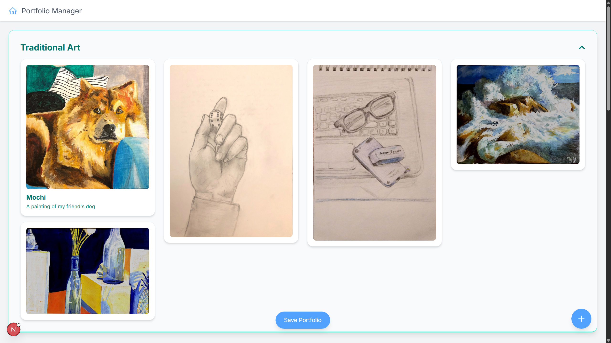

# Portfolio Manager

A responsive, dynamic, single-page application using **Next.js** that allows users to create and manage a multimedia portfolio.
The main features are:

- Uploading images and videos.
- Accessing descriptions and metadata for each item.
- Organizing portfolio items into expandable/collapsible sections.
- Viewing a live preview of the portfolio.
- Saving portfolios by interacting with a backend API.

## Setup

1. Clone this github repo: https://github.com/hansen-yi/Portfolio-Manager.git
2. To run the frontend, type the following into the terminal (assuming you are in cloned folder):
```bash
cd portfolio-manager
npm run dev
```
3. Then to run the backend, open a new terminal and type the following:
```bash
pip install fastapi uvicorn python-multipart pydantic
uvicorn main:app --reload
```
4. Now you should be able to interact with the portfolio manager!

## Feature Walkthrough
<table>
  <tr>
    <td align="center">
      <strong>Home Screen</strong><br>
      
    </td>
    <td align="center">
      <strong>Sample Portfolio</strong><br>
      <a href="./demo_files/EntireSamplePortfolio.png">
        
      </a><br>
      <em style="font-size: 0.9em;">Click image to view full sample portfolio.</em>
    </td>
  </tr>
</table>

https://github.com/user-attachments/assets/e1e634fb-b69a-47bc-8136-49a5d0d2576c

The features in the video are shown in the following order:
1. Creating a new portfolio
2. Adding a new item to the portfolio
3. Missing data error check
4. Uploading image to the portfolio
5. Uploaded image preview
6. Labeling the image
7. Saving the portfolio
8. Loading the same portfolio
9. Portfolio preview mode (same as just viewing it)
10. Loading a different portfolio
11. Video support
12. Collapsible categories

## Future Improvements
- Live Demo (for easier access)
- Edit Portfolio Items
  - Change category, description, title, etc.
  - Remove items
  - Resize (more advanced)
- Reorder items (maybe using react-masonry-css)
- Reorder category groupings
- Additional backend changes
  - Remove getting image from backend endpoint
  - Add or modify endpoint so that titles can be assigned for each portfolio
  - Modify endpoints so that a user can gain access to all their portfolios => frontend change needed as well
  - Store portfolios in cache so that refreshing doesn't lose them (might be connected to enabling a live demo)
- More customizations
  - Allow users to change colors
  - Create "unconstrained" setting, more free organization without grouping items by categories
